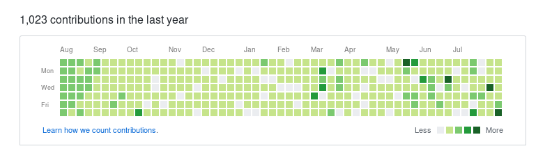

# Type and Commit

Credit to [MarinX's golang keylogger](https://github.com/MarinX/keylogger)

## How it works

It will set the time to a year ago minus five days (where contribution graphs start) and then add a commit for every character every day until the day before today. 

It sounds confusing but if you type enough, you'll be happy with the green you see



## How to use

To use with `vim`, go ahead and run the following

```bash
$ go get github.com/MarinX/keylogger
$ go build editor.go
$ sudo ./editor filename
```

_**Root permissions are needed to listen to key events**_

To simply use the keylogger program, go ahead and follow these instructions instead

```bash
$ go get github.com/MarinX/keylogger
$ go build logncommit.go
$ sudo ./logncommit
```

When done, <kbd>Ctrl + C</kbd> and push your new commits!

```bash
$ sudo git push origin master
```

_**Root permissions are needed since we commit under root**_

## How to set up permanent log-in in Linux

If you're like me and clone via https, then you'll need to save your credentials somewhere in order to use this.

Your options are to do one of the following (you don't need to do both!)

* [Cache your credentials for limited time](https://github.com/MarinX/keylogger)
* [Create a credentials file in a directory](https://github.com/MarinX/keylogger)

## How to return my timing to normal

Not to sure if this is needed but, if so, run the following to unset the hacky environment variables

```bash
$ unset GIT_AUTHOR_DATE
$ unset GIT_COMMIT_DATE
```
